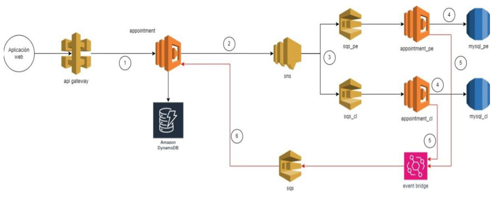

<!--
title: 'Reto Técnico - AWS HTTP Endpoint in NodeJS with Serverless Framework'
description: 'I will demonstrates how to make a simple HTTP API with Node.js running on AWS Lambda and API Gateway using the Serverless Framework.'
layout: Doc
framework: v4
platform: AWS
language: nodeJS
authorLink: 'https://github.com/serverless'
authorName: 'Serverless, Inc.'
authorAvatar: 'https://avatars1.githubusercontent.com/u/13742415?s=200&v=4'
-->

# Reto Técnico - Serverless Framework Node HTTP API on AWS

Se utilizó el simple HTTP API con Node.js desplegandose en AWS Lambda y API Gateway usando Serverless Framework.

## Modo de Uso

### Deployment

Para deployar el proyecto Serverless, primero se debe ejecutar el CDK de la Infraestructura en AWS que está en el siguiente repositorio: https://github.com/Dvex/Appointment-CDK.

Se debe configurar el AWS account/region, de la cuenta a usar en AWS, para ejecutar los comandos que deployará la arquitectura:

```
$ cdk synth
$ cdk deploy
```
pueda desplegar la arquitectura completa.

Una vez implementada la arquitectura, se debe hacer deploy del proyecto Serverless:

```
serverless deploy
```

Los endpoints a testear son los siguientes:

```

✔ Los servicios estan deployandos y las URLS son las siguientes:

endpoints:
  POST - https://1r7j5w6i42.execute-api.us-east-1.amazonaws.com/dev/appointment
  GET - https://1r7j5w6i42.execute-api.us-east-1.amazonaws.com/dev/appointment/{insuredId}
  DOCUMENTACION - https://1r7j5w6i42.execute-api.us-east-1.amazonaws.com/dev/doc
```

### Invocacion

Puedes usar Postman o cURL (según tus preferencias) para poder invocar las APIs:

```
curl https://xxxxxxx.execute-api.us-east-1.amazonaws.com/
```

### Arquitectura Implementada

La arquitectura implementada es la siguiente:

